# Manual Técnico — Practica 2: Carga de Datos en Base de Datos, y Obtencion de Reportes.
**Nombre:** Jairo Adelso Gomez Hernandez  
**Carnet:** 201902672  
**Herramientas:** Oracle SQL Developer

> **Objetivo:** Cargar correctamente los datos del Excel respetando PK/FK, ejecutar las 4 consultas solicitadas y documentar evidencia en el manual.

---

## 1) Estructura de entrega

Crea una carpeta con esta estructura:

```
PRACTICA2_201902672/
├─ Carga/
│ └─ Data_Practica2_BD1.xlsx
│
├─ Consultas/
│ ├─ Consulta1.sql
│ ├─ Consulta2.sql
│ ├─ Consulta3.sql
│ └─ Consulta4.sql
│
├─ Documentation/
│ └─ Manual_Tecnico.md
├ └─ img/
│
└─ Modelado/
├─ Practica2_201902672/
├─ DDL.sql
└─ Practica2_201902672.dmd
```

---

## 2) Preparación

### 2.1 Crear conexión en Oracle SQL Developer
1. Abrir **Oracle SQL Developer**.
2. Panel **Connections** → **New Connection**.
3. Llenar:
   - **Username**: tu usuario (ej. `JAIRO`)
   - **Password**: tu contraseña
   - **Hostname**: `localhost`
   - **Port**: `1521`
   - **Service name**: `XEPDB1` (si usas Oracle XE típico)
4. Click **Test** → luego **Connect**.


---


## 3) Orden correcto de importación

Importa los datos en este orden:

1. **CENTRO**
2. **ESCUELA**
3. **DEPARTAMENTO**
4. **MUNICIPIO** *(depende de DEPARTAMENTO)*
5. **UBICACION** *(depende de ESCUELA y CENTRO)*
6. **PREGUNTA**
7. **PREGUNTA_PRACTICO**
8. **REGISTRO** *(depende de ESCUELA, CENTRO, MUNICIPIO)*
9. **CORRELATIVO**
10. **EXAMEN** *(depende de REGISTRO y CORRELATIVO)*
11. **RESPUESTA_USUARIO** *(depende de EXAMEN y PREGUNTA)*
12. **RESPUESTA_PRACTICO_USUARIO** *(depende de EXAMEN y PREGUNTA_PRACTICO)*


---

## 4) Cómo importar una hoja del Excel en SQL Developer

Para cada tabla:

1. En SQL Developer: **Tables → [Tu tabla] → (Click derecho) → Import Data...**
2. Seleccionar el archivo **.xlsx**
3. Elegir la **hoja** correcta
4. Revisar el **mapeo de columnas**
5. Ejecutar

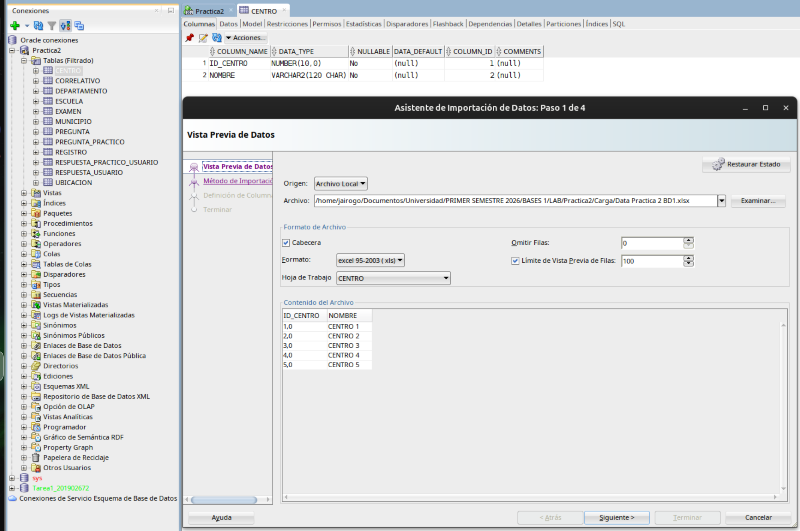
> **TIP:** Si el asistente de Excel falla, exporta la hoja a **CSV** y repite el import desde CSV.

---

## 5) Mapeo de columnas (atributos a seleccionar)

> Nota: los nombres exactos del Excel pueden variar, pero el criterio es: **Excel → columna real de la tabla**.

### 5.1 CENTRO
**Tabla:** `CENTRO`
- `ID_CENTRO` → `ID_CENTRO`
- `NOMBRE` → `NOMBRE`


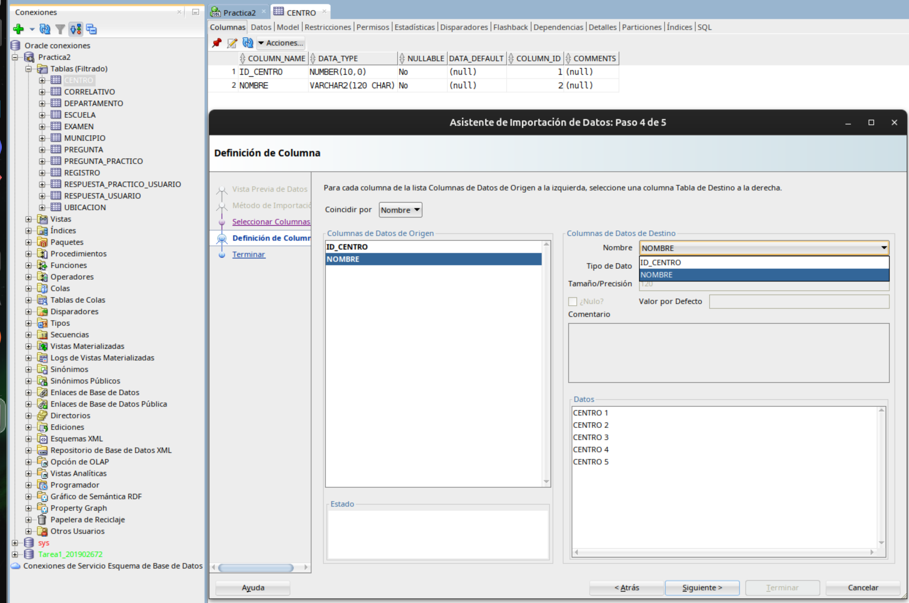
---

### 5.2 ESCUELA
**Tabla:** `ESCUELA`
- `ID_ESCUELA` → `ID_ESCUELA`
- `NOMBRE` → `NOMBRE`
- `DIRECCION` → `DIRECCION`
- `ACUERDO` → `ACUERDO`

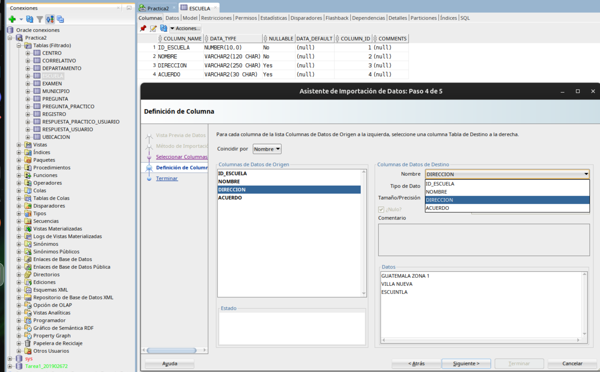
---

### 5.3 DEPARTAMENTO
**Tabla:** `DEPARTAMENTO`
- `ID_DEPARTAMENTO` → `ID_DEPARTAMENTO`
- `NOMBRE` → `NOMBRE`
- `CODIGO` → `CODIGO`

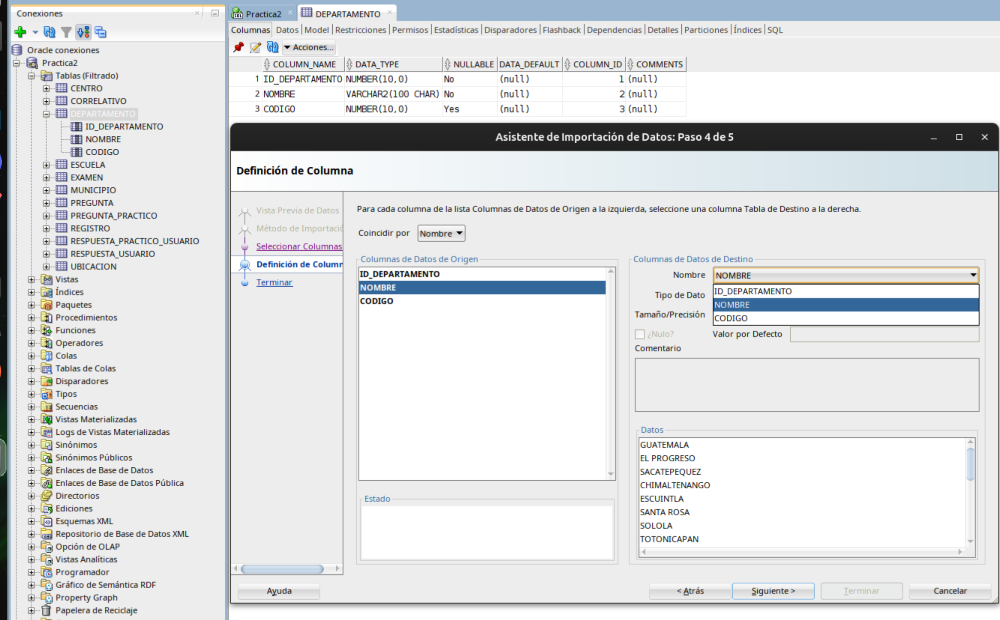
---

### 5.4 MUNICIPIO
**Tabla:** `MUNICIPIO`
- `ID_MUNICIPIO` → `ID_MUNICIPIO`
- `DEPARTAMENTO_ID_DEPARTAMENTO` → `DEPARTAMENTO_ID_DEPARTAMENTO`
- `NOMBRE` → `NOMBRE`
- `CODIGO` → `CODIGO`


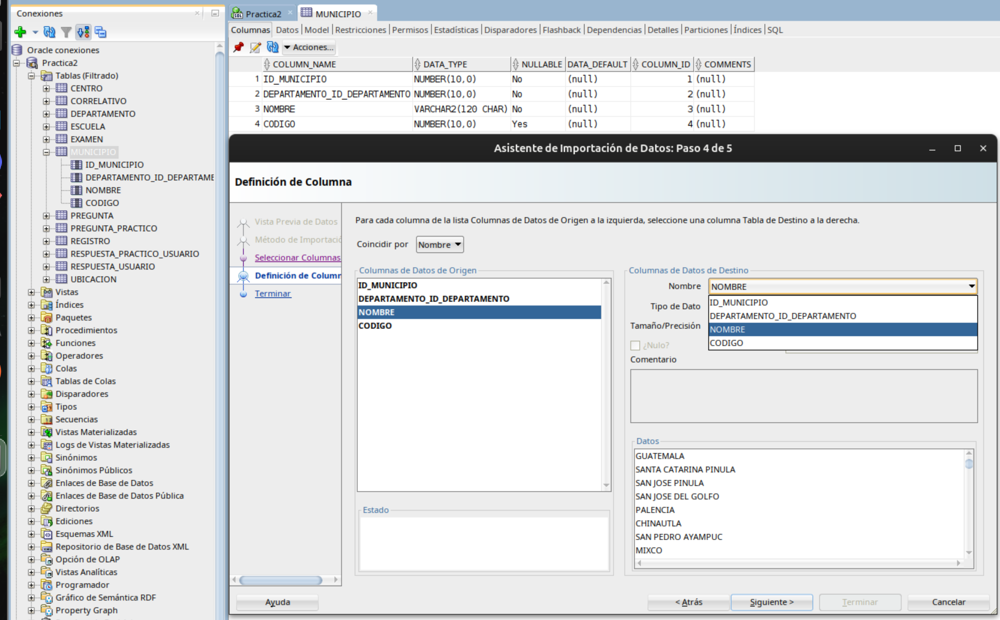
---

### 5.5 UBICACION
**Tabla:** `UBICACION`
- `UBICACION_ESCUELA_ID_ESCUELA`  → `ID_ESCUELA`
- `UBICACION_CENTRO_ID_CENTRO`  → `ID_CENTRO`

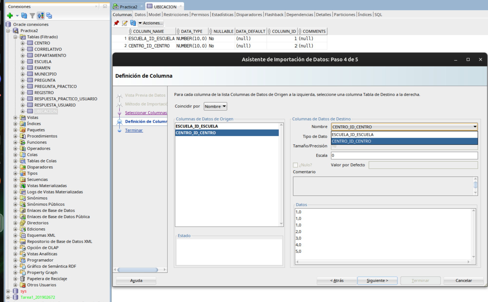
---

### 5.6 PREGUNTA
**Tabla:** `PREGUNTA`
- `ID_PREGUNTA` → `ID_PREGUNTA`
- `PREGUNTA_TEXTO` → `TEXTO`
- `RES1` → `RES1`
- `RES2` → `RES2`
- `RES3` → `RES3`
- `RES4` → `RES4`
- `RESPUESTA`  → `CORRECTA`

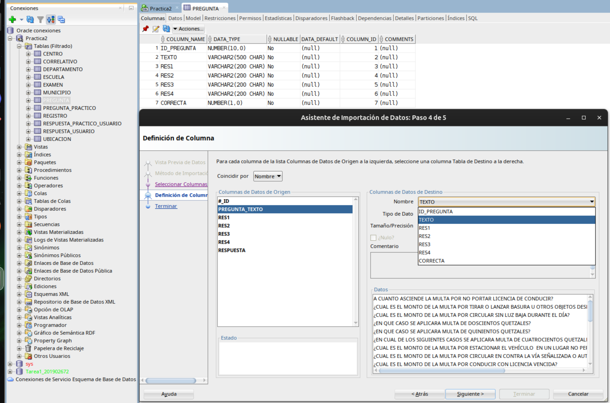


---

### 5.7 PREGUNTA_PRACTICO
**Tabla:** `PREGUNTA_PRACTICO`
- `ID_PREGUNTA_PRACTICO` → `ID_PREG_PRACTICO`
- `PREGUNTA_TEXTO` → `TEXTO`
- `PUNTEO` → `PUNTEO`

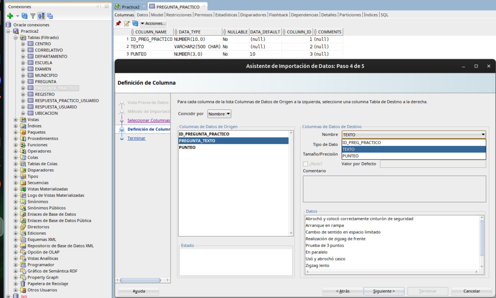

---

### 5.8 REGISTRO
**Tabla:** `REGISTRO`
- `ID_REGISTRO` → `ID_REGISTRO`
- `UBICACION_ESCUELA_ID_ESCUELA` → `ESCUELA_ID_ESCUELA`
- `UBICACION_CENTRO_ID_CENTRO` → `CENTRO_ID_CENTRO`
- `MUNICIPIO_ID_MUNICIPIO` → `MUNICIPIO_ID_MUNICIPIO`
- `FECHA` → `FECHA`
- `TIPO_TRAMITE` → `T_TRAMITE`
- `TIPO_LICENCIA` → `T_LICENCIA`
- `NOMBRE_COMPLETO` → `NOMBRE_COMPLETO`
- `GENERO` → `GENERO`

🚫 **No mapear (redundante):**
- `MUNICIPIO_DEPARTAMENTO_ID_DEPARTAMENTO` (se infiere por la FK de MUNICIPIO)

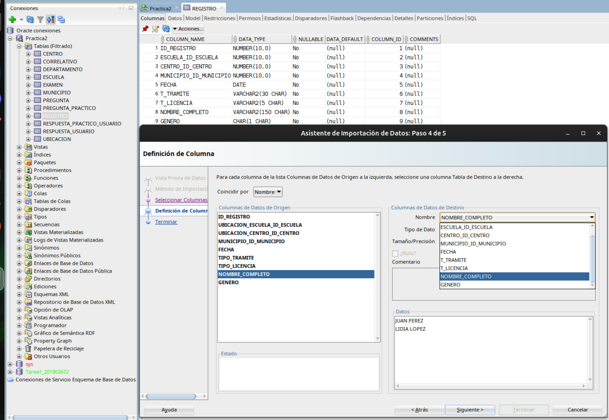

---

### 5.9 CORRELATIVO
**Tabla:** `CORRELATIVO`
- `ID_CORRELATIVO` → `ID_CORRELATIVO`
- `FECHA` → `FECHA`
- `NO_EXAMEN` → `NO_EXAMEN`

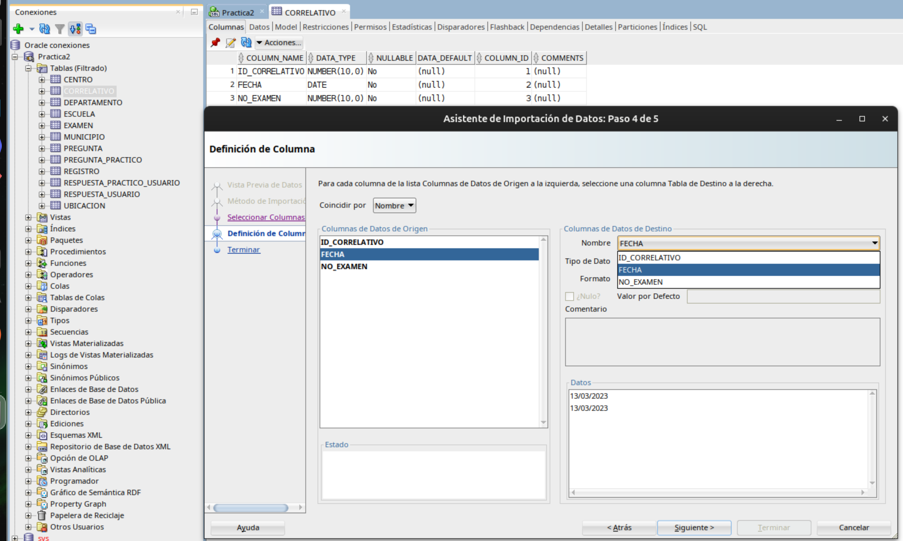

---

### 5.10 EXAMEN
**Tabla:** `EXAMEN`
- `ID_EXAMEN` → `ID_EXAMEN`
- `REGISTRO_ID_REGISTRO` → `REGISTRO_ID_REGISTRO`
- `CORRELATIVO_ID_CORRELATIVO` → `CORRELATIVO_ID_CORRELATIVO`

🚫 **No mapear (arrastradas desde Registro/Municipio):**
- `REGISTRO_ID_ESCUELA`
- `REGISTRO_ID_CENTRO`
- `REGISTRO_MUNICIPIO_ID_MUNICIPIO`
- `REGISTRO_MUNICIPIO_DEPARTAMENTO_ID...`

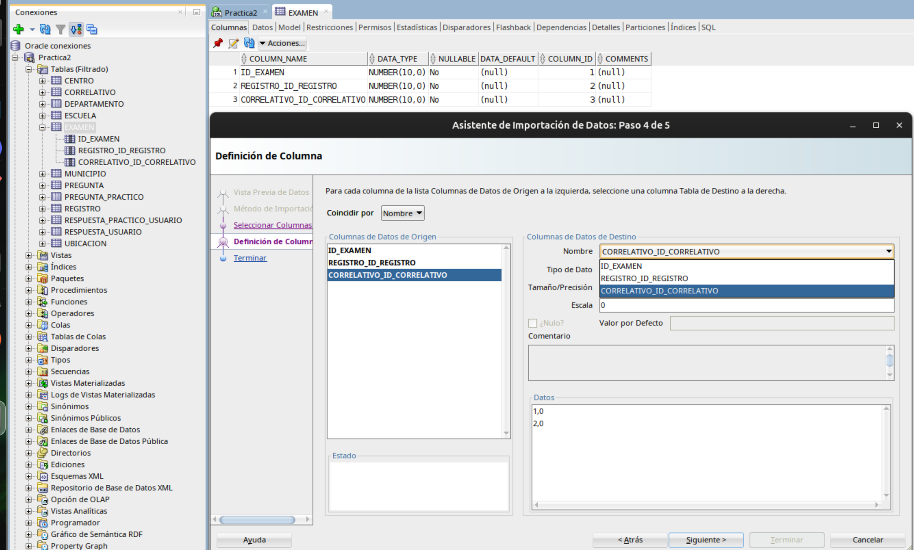

---

### 5.11 RESPUESTA_USUARIO
**Tabla:** `RESPUESTA_USUARIO`
- `ID_RESPUESTA_USUARIO` → `ID_RESPUESTA_USUARIO`
- `PREGUNTA_ID_PREGUNTA` → `PREGUNTA_ID_PREGUNTA`
- `EXAMEN_ID_EXAMEN` → `EXAMEN_ID_EXAMEN`
- `RESPUESTA` → `RESPUESTA`

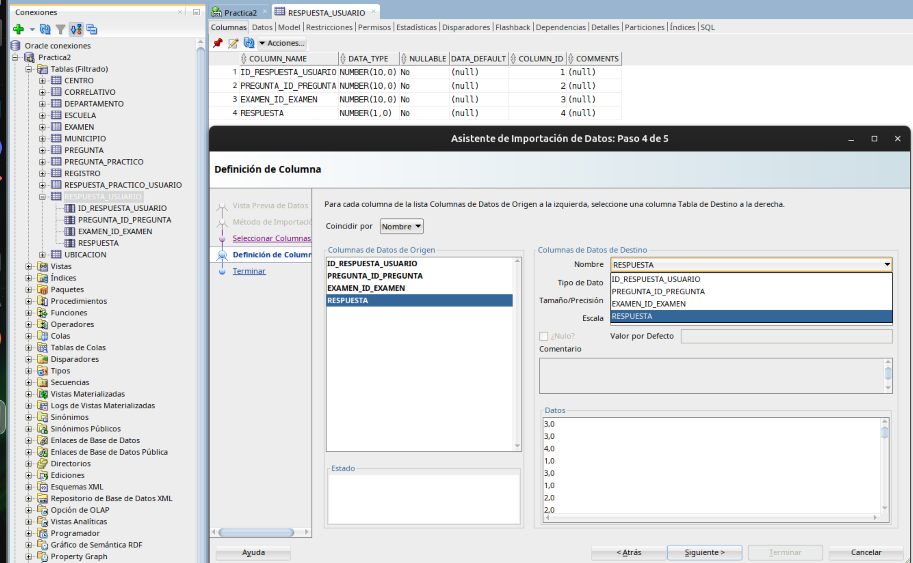

---

### 5.12 RESPUESTA_PRACTICO_USUARIO
**Tabla:** `RESPUESTA_PRACTICO_USUARIO`
- `ID_RESPUESTA_PRACTICO` → `ID_RESPUESTA_PRACTICO`
- `PREGUNTA_PRACTICO_ID_PREG_PRACTICO` → `PREGUNTA_PRACTICO_ID_PREG_PRACTICO`
- `EXAMEN_ID_EXAMEN` → `EXAMEN_ID_EXAMEN`
- `NOTA` → `NOTA`

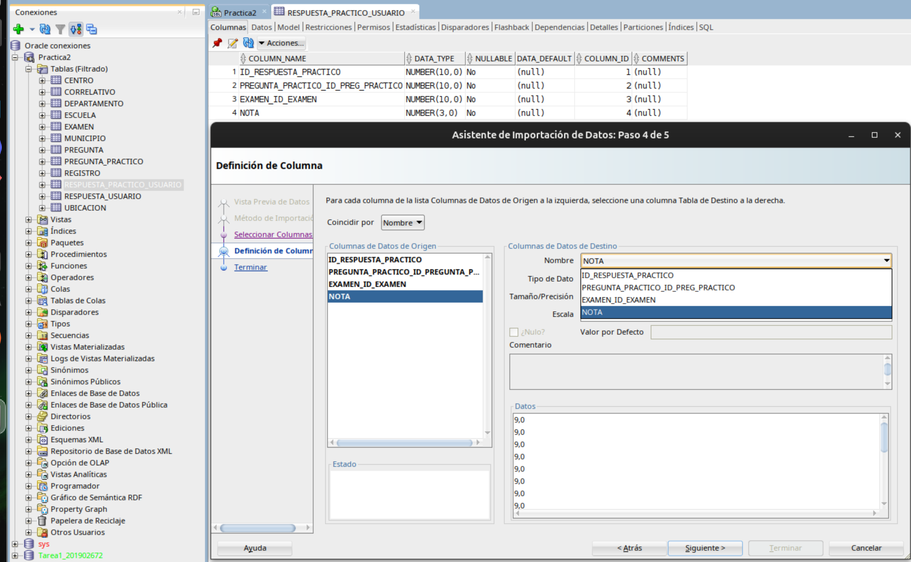

---

## 6) Verificación final

Ejecuta este script de verificación:

```sql
SELECT 'CENTRO' tabla, COUNT(*) total FROM Centro
UNION ALL SELECT 'ESCUELA', COUNT(*) FROM Escuela
UNION ALL SELECT 'UBICACION', COUNT(*) FROM Ubicacion
UNION ALL SELECT 'DEPARTAMENTO', COUNT(*) FROM Departamento
UNION ALL SELECT 'MUNICIPIO', COUNT(*) FROM Municipio
UNION ALL SELECT 'REGISTRO', COUNT(*) FROM Registro
UNION ALL SELECT 'CORRELATIVO', COUNT(*) FROM Correlativo
UNION ALL SELECT 'EXAMEN', COUNT(*) FROM Examen
UNION ALL SELECT 'PREGUNTA', COUNT(*) FROM Pregunta
UNION ALL SELECT 'PREGUNTA_PRACTICO', COUNT(*) FROM Pregunta_Practico
UNION ALL SELECT 'RESPUESTA_USUARIO', COUNT(*) FROM Respuesta_Usuario
UNION ALL SELECT 'RESPUESTA_PRACTICO_USUARIO', COUNT(*) FROM Respuesta_Practico_Usuario;
```

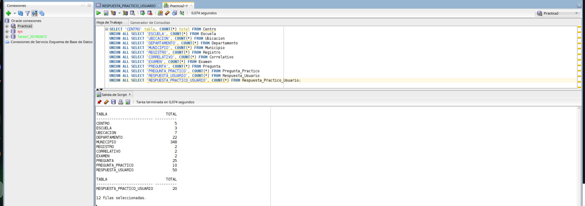
---

## 7) Evidencia de Consultas

### **Resultado Consulta 1**

```sql

-- =========================================================================
-- LISTADO DE TODAS LAS EVALUACIONES REALIZADAS EN EL DIA. LA CONSULTA DEBE RECIBIR DE PARAMETRO
-- LA FECHA A CONSULTAR Y COMO RESULTADO DEBERA MOSTRAR TODOS LOS DATOS GENERALES DEL EVALUADO
-- ASI COMO TAMBIEN LAS NOTAS OBTENIDAS Y SI FUE APROBADO O REPROBADO
-- =========================================================================
-- =========================================================================
-- Cálculo de la Nota Teórica
-- =========================================================================
WITH Nota_Teorica AS (
  SELECT 
    ru.examen_id_examen,
    -- SeCompara la respuesta del usuario con la correcta. 
    -- Se Saca el promedio se redondea a 2 decimales.
    ROUND(
      100 * SUM(CASE WHEN ru.respuesta = p.correcta THEN 1 ELSE 0 END) / COUNT(*)
    , 2) AS total_teorico
  FROM Respuesta_Usuario ru
  JOIN Pregunta p ON p.id_pregunta = ru.pregunta_id_pregunta
  GROUP BY ru.examen_id_examen
),

-- =========================================================================
-- Cálculo de la Nota Práctica
-- =========================================================================
Nota_Practica AS (
  SELECT 
    rpu.examen_id_examen,
    -- Se Multiplica la nota obtenida por el punteo real de la pregunta.
    -- El 10.0 asegura la precisión decimal en la división.
    ROUND(
      SUM(rpu.nota * (pp.punteo / 10.0))
    , 2) AS total_practico
  FROM Respuesta_Practico_Usuario rpu
  JOIN Pregunta_Practico pp ON pp.id_preg_practico = rpu.pregunta_practico_id_preg_practico
  GROUP BY rpu.examen_id_examen
)

-- =========================================================================
-- Consulta Principal: Unión de datos y evaluación final
-- =========================================================================
SELECT 
  -- Datos de control del examen
  ex.id_examen,
  TRUNC(co.fecha) AS fecha_evaluacion,
  co.no_examen,
  
  -- Datos del registro y del aspirante
  r.id_registro,
  r.fecha AS fecha_registro,
  r.escuela_id_escuela,
  r.centro_id_centro,
  r.municipio_id_municipio,
  r.t_tramite,
  r.t_licencia,
  r.nombre_completo,
  r.genero,
  
  -- Extraemos las notas calculadas. 
  -- Si no hay registro, asignamos 0 por defecto.
  NVL(nt.total_teorico, 0) AS nota_teorica,
  NVL(np.total_practico, 0) AS nota_practica,
  
  -- Lógica de aprobación: Requiere 70 o más en AMBAS pruebas
  CASE 
    WHEN NVL(nt.total_teorico, 0) >= 70 AND NVL(np.total_practico, 0) >= 70 THEN 'APROBADO'
    ELSE 'REPROBADO'
  END AS estado

FROM Examen ex

-- Union con las tablas necesarias para obtener la información completa del examen y el registro
JOIN Correlativo co ON co.id_correlativo = ex.correlativo_id_correlativo
JOIN Registro r     ON r.id_registro     = ex.registro_id_registro

-- LEFT JOIN para asegurar que el examen aparezca aunque falte alguna de las dos notas
LEFT JOIN Nota_Teorica nt  ON nt.examen_id_examen = ex.id_examen
LEFT JOIN Nota_Practica np ON np.examen_id_examen = ex.id_examen

-- Filtro de fecha exacto
WHERE TRUNC(co.fecha) = DATE '2023-03-13'

-- Ordenamiento final para la presentación del reporte
ORDER BY co.no_examen, ex.id_examen;


```

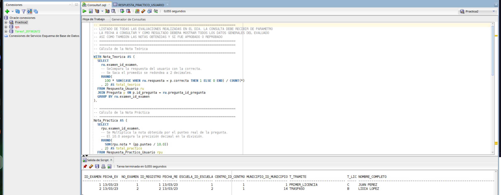

### **Resultado Consulta 2**

```sql

-- =========================================================================
-- En base a un rango de fechas, mostrar las notas de las evaluaciones
-- considerando solo las evaluaciones APROBADAS.
-- =========================================================================

WITH
-- Parámetros del rango (cambia aquí)
params AS (
  SELECT
    DATE '2023-03-13' AS fecha_ini,
    DATE '2023-03-13' AS fecha_fin
  FROM dual
),

-- =========================================================================
-- Cálculo de la Nota Teórica (por examen)
-- =========================================================================
Nota_Teorica AS (
  SELECT 
    ru.examen_id_examen,
    ROUND(
      100 * SUM(CASE WHEN ru.respuesta = p.correcta THEN 1 ELSE 0 END) / COUNT(*)
    , 2) AS total_teorico
  FROM Respuesta_Usuario ru
  JOIN Pregunta p ON p.id_pregunta = ru.pregunta_id_pregunta
  GROUP BY ru.examen_id_examen
),

-- =========================================================================
-- Cálculo de la Nota Práctica (por examen)
-- =========================================================================
Nota_Practica AS (
  SELECT 
    rpu.examen_id_examen,
    ROUND(
      SUM(rpu.nota * (pp.punteo / 10.0))
    , 2) AS total_practico
  FROM Respuesta_Practico_Usuario rpu
  JOIN Pregunta_Practico pp ON pp.id_preg_practico = rpu.pregunta_practico_id_preg_practico
  GROUP BY rpu.examen_id_examen
)

-- =========================================================================
-- Consulta principal (solo aprobadas)
-- =========================================================================
SELECT 
  ex.id_examen,
  TRUNC(co.fecha) AS fecha_evaluacion,
  co.no_examen,

  r.nombre_completo,
  r.t_tramite,
  r.t_licencia,

  NVL(nt.total_teorico, 0) AS nota_teorica,
  NVL(np.total_practico, 0) AS nota_practica,

  'APROBADO' AS estado
FROM Examen ex
JOIN Correlativo co ON co.id_correlativo = ex.correlativo_id_correlativo
JOIN Registro r     ON r.id_registro     = ex.registro_id_registro

LEFT JOIN Nota_Teorica nt  ON nt.examen_id_examen = ex.id_examen
LEFT JOIN Nota_Practica np ON np.examen_id_examen = ex.id_examen
CROSS JOIN params pa

WHERE TRUNC(co.fecha) BETWEEN pa.fecha_ini AND pa.fecha_fin
  AND NVL(nt.total_teorico, 0) >= 70
  AND NVL(np.total_practico, 0) >= 70

ORDER BY TRUNC(co.fecha), co.no_examen, ex.id_examen;

```


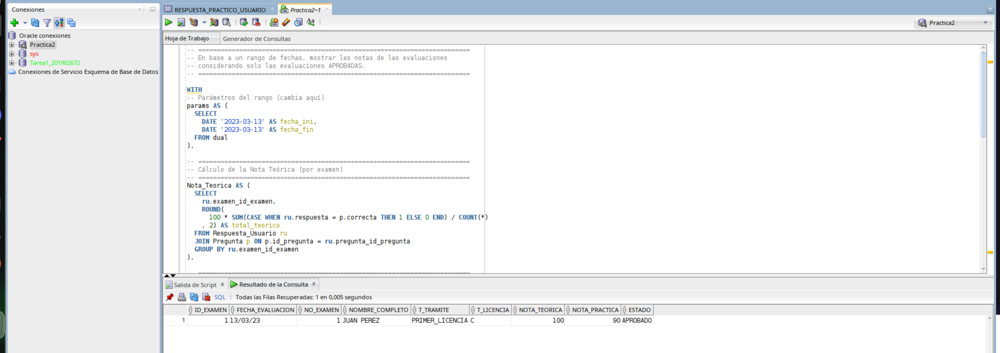

### **Resultado Consulta 3**

```sql

-- ===================================================================================
-- EN BASE A UN RANGO DE FECHAS, MOSTRAR CUANTOS REGISTROS DE EVALUACIONES FUERON
-- REALIZADAS POR TIPO DE TRAMITE Y TIPO DE LICNCIA SOLICITADA
-- =================================================================================== 

-- SELECCIONAMOS LAS COLUMNAS DESEADAS
SELECT 
  r.t_tramite,
  r.t_licencia,
  
  -- CONTAMOS LA CANTIDAD DE ID's QUE HAY EN EXAMEN
  COUNT(ex.id_examen) AS total_evaluaciones
  
FROM Examen ex

-- SE UNEN LAS TABLAS PARA OBTENER LA FECHA DEL CORRELATIVO Y LOS DETALLES DE REGISTRO
  
  JOIN Correlativo co ON co.id_correlativo = ex.correlativo_id_correlativo
  JOIN Registro r     ON r.id_registro     = ex.registro_id_registro
  
  -- SE FILTRA ESTRICTAMENTE EL RANGO
  WHERE TRUNC(co.fecha) BETWEEN DATE '2023-03-13' AND DATE '2023-03-20'
  
-- AGRUPAMOS Y ORDENAMOS
GROUP BY t_tramite, t_licencia
ORDER BY total_evaluaciones DESC, t_tramite, t_licencia;

```


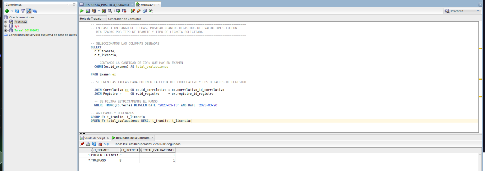

### **Resultado Consulta 4**

```sql

-- =========================================================================
-- Listar las preguntas con mayores aciertos en base a un rango de fechas.
-- =========================================================================

-- PARAMETROS
WITH params AS (
  SELECT 
    DATE '2023-03-13' AS fecha_ini,
    DATE '2023-03-13' AS fecha_fin
  FROM dual
)
SELECT

-- SELECCIONAMOS LOS ATRIBUTOS
  p.id_pregunta,
  p.texto,
  
  -- CONTAMOS LA CANTIDAD DE INTENTOS
  COUNT(*) AS total_intentos,
  
  -- CALCULAMOS LOS ACIERTOS
  SUM(CASE WHEN ru.respuesta = p.correcta THEN 1 ELSE 0 END) AS aciertos,
  
  -- TOTAL INTENTOS - ACIERTOS = CANTIDAD DE ERRORES
  COUNT(*) - SUM(CASE WHEN ru.respuesta = p.correcta THEN 1 ELSE 0 END) AS errores,
  
  -- SE MULTIPLICA POR 100.0 PARA ASEGURAR LA PRECISION DECIMAL
  ROUND(
    100.0 * SUM(CASE WHEN ru.respuesta = p.correcta THEN 1 ELSE 0 END) / COUNT(*), 2) AS porcentaje_acierto
    
-- TABLA PRINCIPAL DE DONDE SE PARTE
FROM Respuesta_Usuario ru

-- SE UNEN LAS TABLAS NECESARIAS PARA OBTENER ID PREGUNTA, ID EXAMEN Y ID DEL CORRELATIVO
JOIN Pregunta p     ON p.id_pregunta = ru.pregunta_id_pregunta
JOIN Examen ex      ON ex.id_examen  = ru.examen_id_examen
JOIN Correlativo co ON co.id_correlativo = ex.correlativo_id_correlativo

-- COMBINAMOS LOS PARAMETROS 
CROSS JOIN params pa

-- EVALUAMOS DESDE EL INICIO DEL DIA. HASTA EL COMIENZO DEL SIGUIENTE DIA
WHERE co.fecha >= pa.fecha_ini 
  AND co.fecha <  pa.fecha_fin + 1

-- AGRUPAMOS Y ORDENAMOS DESCENDENTEMENTE 
GROUP BY p.id_pregunta, p.texto
ORDER BY aciertos DESC, porcentaje_acierto DESC, total_intentos DESC, p.id_pregunta;

```

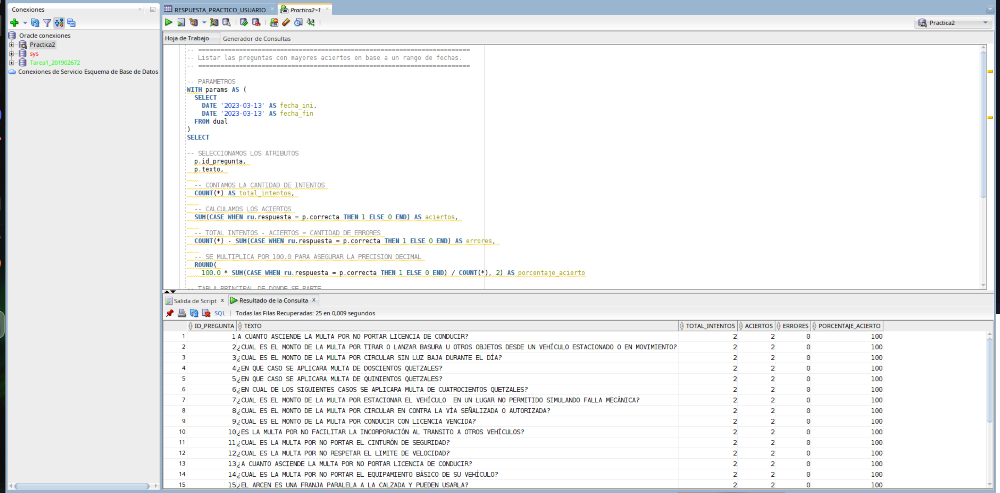
---

