# Proyecto 2 Sistemas de Bases de Datos 1

**Universidad:** Universidad de San Carlos de Guatemala  
**Facultad:** Facultad de Ingeniería  
**Curso:** Sistemas de Bases de Datos 1  
**Proyecto:** Proyecto 2 - Centros de Evaluación de Manejo  
**Carnet:** 201902672  
**Estudiante:** Jairo Adelso Gomez Hernandez  

---

## 1. Resumen ejecutivo

El proyecto consiste en construir una solución backend para el sistema de **Centros de Evaluación de Manejo de Guatemala**. La solución integra una base de datos Oracle XE ejecutándose en Docker, scripts de inicialización automática para crear el esquema y cargar datos iniciales, y una API REST desarrollada con **Node.js y Express** para consumir la información sin manipular directamente las tablas desde el gestor de base de datos.

El sistema permite realizar operaciones **CRUD** sobre las 12 tablas del modelo relacional y expone tres consultas estadísticas solicitadas: estadísticas de evaluaciones por centro y escuela, ranking de evaluados por resultado final, e identificación de la pregunta o preguntas con menor porcentaje de aciertos.

---

## 2. Objetivos del proyecto

### Objetivo general

Implementar una API REST conectada a una base de datos Oracle dockerizada, permitiendo administrar la información del modelo de centros de evaluación y consultar estadísticas relevantes mediante endpoints probados en Postman.

### Objetivos específicos

- Dockerizar Oracle XE 21c y permitir su ejecución mediante `docker-compose.yml`.
- Inicializar automáticamente el esquema DDL y los datos semilla al levantar el contenedor.
- Desarrollar endpoints CRUD para todas las tablas del modelo físico.
- Desarrollar tres endpoints de consultas estadísticas.
- Validar el funcionamiento mediante DBeaver y una colección de Postman.
- Documentar el despliegue, conexión, uso de endpoints y evidencia de pruebas.

---
`
## 3. Tecnologías utilizadas

| Tecnología | Uso dentro del proyecto |
|---|---|
| Docker | Contenerización de Oracle XE |
| Docker Compose | Orquestación y persistencia del contenedor |
| Oracle XE 21c | Motor de base de datos relacional |
| DBeaver | Administración y validación de la base de datos |
| Node.js | Entorno de ejecución del backend |
| Express.js | Framework para construir la API REST |
| oracledb | Driver para conectar Node.js con Oracle |
| dotenv | Manejo de variables de entorno |
| nodemon | Reinicio automático del servidor en desarrollo |
| Postman | Pruebas y documentación de endpoints |

---

## 4. Estructura recomendada del repositorio

```text
SBD1B_1S2026_201902672/
├── backend/
│   ├── src/
│   │   ├── config/
│   │   │   └── db.js
│   │   ├── controllers/
│   │   │   ├── centro.controller.js
│   │   │   ├── departamento.controller.js
│   │   │   ├── escuela.controller.js
│   │   │   ├── municipio.controller.js
│   │   │   ├── ubicacion.controller.js
│   │   │   ├── registro.controller.js
│   │   │   ├── correlativo.controller.js
│   │   │   ├── examen.controller.js
│   │   │   ├── preguntas.controller.js
│   │   │   ├── preguntasPractico.controller.js
│   │   │   ├── respuestaUsuario.controller.js
│   │   │   ├── respuestaPracticoUsuario.controller.js
│   │   │   └── consultas.controller.js
│   │   ├── routes/
│   │   │   ├── centro.routes.js
│   │   │   ├── departamento.routes.js
│   │   │   ├── escuela.routes.js
│   │   │   ├── municipio.routes.js
│   │   │   ├── ubicacion.routes.js
│   │   │   ├── registro.routes.js
│   │   │   ├── correlativo.routes.js
│   │   │   ├── examen.routes.js
│   │   │   ├── preguntas.routes.js
│   │   │   ├── preguntasPractico.routes.js
│   │   │   ├── respuestaUsuario.routes.js
│   │   │   ├── respuestaPracticoUsuario.routes.js
│   │   │   ├── consultas.routes.js
│   │   │   └── db.routes.js
│   │   ├── app.js
│   │   └── server.js
│   ├── .env
│   ├── package.json
│   └── package-lock.json
├── database/
│   └── init/
│       ├── 01_schema_cem_user.sql
│       └── 02_seed_data.sql
├── docs/
│   └── evidencias/
├── docker-compose.yml
├── SBD1_PROYECTO2_201902672.postman_collection.json
└── README.md
```

---

## 5. Infraestructura Docker

### 5.1 Archivo `docker-compose.yml`

```yaml
services:
  oracle-db:
    image: gvenzl/oracle-xe:21
    container_name: sbd1_proyecto2_oracle
    ports:
      - "1522:1521"
    environment:
      ORACLE_PASSWORD: oracle
      APP_USER: CEM_USER
      APP_USER_PASSWORD: cem123
    volumes:
      - oracle-proyecto2-data:/opt/oracle/oradata
      - ./database/init:/container-entrypoint-initdb.d
    restart: unless-stopped

  backend:
    build:
      context: ./backend
      dockerfile: Dockerfile
    container_name: sbd1_proyecto2_api
    ports:
      - "3000:3000"
    environment:
      PORT: 3000
      DB_USER: CEM_USER
      DB_PASSWORD: cem123
      DB_CONNECT_STRING: oracle-db:1521/XEPDB1
    depends_on:
      - oracle-db
    restart: unless-stopped

volumes:
  oracle-proyecto2-data:
```


### 5.1.1 Archivo `Dockerfile` para el backend

```dockerfile
FROM node:22-bookworm-slim

WORKDIR /app

COPY package*.json ./

RUN npm ci --omit=dev

COPY src ./src

ENV NODE_ENV=production

EXPOSE 3000

CMD ["npm", "start"]

```

### 5.2 Explicación

- `gvenzl/oracle-xe:21`: imagen utilizada para ejecutar Oracle XE 21c.
- `1522:1521`: el puerto local 1522 se conecta al puerto interno 1521 de Oracle.
- `APP_USER`: crea el usuario de aplicación `CEM_USER`.
- `APP_USER_PASSWORD`: define la contraseña del usuario de aplicación.
- `./database/init:/container-entrypoint-initdb.d`: permite ejecutar automáticamente scripts SQL cuando la base se inicializa por primera vez.
- `oracle-proyecto2-data`: volumen persistente para conservar la información de la base de datos.
- El servicio `backend` se construye a partir del `Dockerfile` ubicado en la carpeta `backend`, expone el puerto 3000 y depende de que el servicio `oracle-db` esté activo para iniciar.
- Si se desea iniciar solo con dockerr sin el backend, se puede comentar la sección del servicio `backend` en el `docker-compose.yml`.

### 5.3 Comandos de ejecución

```bash
# Levantar la base de datos en segundo plano
docker compose up -d

# Revisar logs del contenedor
docker logs -f sbd1_proyecto2_oracle

# Verificar que el contenedor esté activo
docker ps

# Apagar los servicios
docker compose down

# Borrar contenedor y volumen si se desea reinicializar desde cero
docker compose down -v
```


> 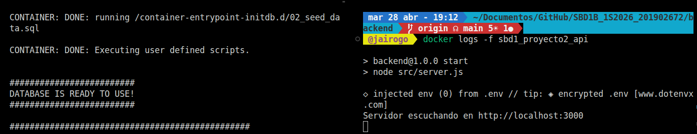

---

## 6. Inicialización automática de la base de datos

El proyecto utiliza scripts SQL dentro de la carpeta `database/init`. Al ejecutar por primera vez `docker compose up -d`, Oracle ejecuta los scripts encontrados en esa carpeta.

| Archivo | Función |
|---|---|
| `01_schema_cem_user.sql` | Crea las tablas, llaves primarias, llaves foráneas, restricciones e índices del esquema. |
| `02_seed_data.sql` | Inserta datos iniciales para probar CRUD, consultas estadísticas e integridad referencial. |

### 6.1 Validación de tablas creadas

```sql
SELECT table_name
FROM user_tables
ORDER BY table_name;
```

Resultado esperado:

| Tabla |
|---|
| CENTRO |
| CORRELATIVO |
| DEPARTAMENTO |
| ESCUELA |
| EXAMEN |
| MUNICIPIO |
| PREGUNTAS |
| PREGUNTAS_PRACTICO |
| REGISTRO |
| RESPUESTA_PRACTICO_USUARIO |
| RESPUESTA_USUARIO |
| UBICACION |

### 6.2 Validación de datos cargados

```sql
SELECT 'CENTRO' AS tabla, COUNT(*) AS cantidad FROM centro
UNION ALL SELECT 'CORRELATIVO', COUNT(*) FROM correlativo
UNION ALL SELECT 'DEPARTAMENTO', COUNT(*) FROM departamento
UNION ALL SELECT 'ESCUELA', COUNT(*) FROM escuela
UNION ALL SELECT 'EXAMEN', COUNT(*) FROM examen
UNION ALL SELECT 'MUNICIPIO', COUNT(*) FROM municipio
UNION ALL SELECT 'PREGUNTAS', COUNT(*) FROM preguntas
UNION ALL SELECT 'PREGUNTAS_PRACTICO', COUNT(*) FROM preguntas_practico
UNION ALL SELECT 'REGISTRO', COUNT(*) FROM registro
UNION ALL SELECT 'RESPUESTA_PRACTICO_USUARIO', COUNT(*) FROM respuesta_practico_usuario
UNION ALL SELECT 'RESPUESTA_USUARIO', COUNT(*) FROM respuesta_usuario
UNION ALL SELECT 'UBICACION', COUNT(*) FROM ubicacion
ORDER BY tabla;
```

También se implementó el endpoint:

```http
GET http://localhost:3000/api/db/conteos
```

Ejemplo de respuesta esperada:

```json
{
  "success": true,
  "data": [
    { "TABLA": "CENTRO", "CANTIDAD": 3 },
    { "TABLA": "CORRELATIVO", "CANTIDAD": 5 },
    { "TABLA": "DEPARTAMENTO", "CANTIDAD": 3 },
    { "TABLA": "ESCUELA", "CANTIDAD": 3 },
    { "TABLA": "EXAMEN", "CANTIDAD": 5 },
    { "TABLA": "MUNICIPIO", "CANTIDAD": 5 },
    { "TABLA": "PREGUNTAS", "CANTIDAD": 4 },
    { "TABLA": "PREGUNTAS_PRACTICO", "CANTIDAD": 4 },
    { "TABLA": "REGISTRO", "CANTIDAD": 5 },
    { "TABLA": "RESPUESTA_PRACTICO_USUARIO", "CANTIDAD": 5 },
    { "TABLA": "RESPUESTA_USUARIO", "CANTIDAD": 6 },
    { "TABLA": "UBICACION", "CANTIDAD": 6 }
  ]
}
```

> 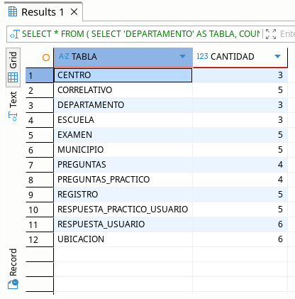

---

## 7. Conexión desde DBeaver

Para conectarse a la base de datos desde DBeaver se utiliza la siguiente configuración:

| Parámetro | Valor |
|---|---|
| Motor | Oracle |
| Host | `localhost` |
| Puerto | `1522` |
| Service name | `XEPDB1` |
| Usuario | `CEM_USER` |
| Contraseña | `cem123` |

Consulta de verificación:

```sql
SELECT USER FROM dual;
```

Resultado esperado:

```text
CEM_USER
```
> 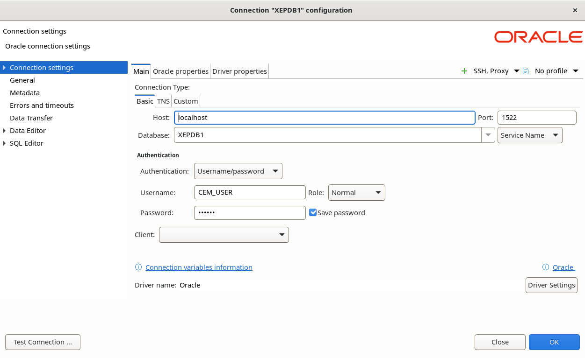
> 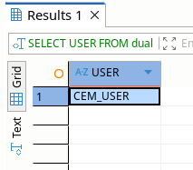

---

## 8. Backend Node.js y Express

### 8.1 Instalación de dependencias

```bash
cd backend
npm install
```

Dependencias principales:

```bash
npm install express cors dotenv oracledb
npm install --save-dev nodemon
```

### 8.2 Variables de entorno

Archivo `backend/.env`:

```env
PORT=3000
DB_USER=CEM_USER
DB_PASSWORD=cem123
DB_CONNECT_STRING=localhost:1522/XEPDB1
```

### 8.3 Ejecución del backend

```bash
cd backend
npm run dev
```

El flujo correcto de ejecución es:

1. Levantar Oracle con `docker compose up -d`.
2. Esperar a que Oracle termine de inicializar.
3. Validar conexión en DBeaver o con `/api/db/conteos`.
4. Ejecutar la API con `npm run dev`.
5. Probar los endpoints desde Postman.

### 8.4 Archivos principales del backend

#### `src/server.js`

```javascript
const app = require('./app');

const PORT = process.env.PORT || 3000;

app.listen(PORT, () => {
  console.log(`API escuchando en http://localhost:${PORT}`);
});
```

#### `src/app.js`

```javascript
const express = require('express');
const cors = require('cors');

const app = express();

app.use(cors());
app.use(express.json());

app.use('/api/db', require('./routes/db.routes'));
app.use('/api/centros', require('./routes/centro.routes'));
app.use('/api/departamentos', require('./routes/departamento.routes'));
app.use('/api/escuelas', require('./routes/escuela.routes'));
app.use('/api/municipios', require('./routes/municipio.routes'));
app.use('/api/ubicaciones', require('./routes/ubicacion.routes'));
app.use('/api/registros', require('./routes/registro.routes'));
app.use('/api/correlativos', require('./routes/correlativo.routes'));
app.use('/api/examenes', require('./routes/examen.routes'));
app.use('/api/preguntas', require('./routes/preguntas.routes'));
app.use('/api/preguntas-practico', require('./routes/preguntasPractico.routes'));
app.use('/api/respuestas-usuario', require('./routes/respuestaUsuario.routes'));
app.use('/api/respuestas-practico-usuario', require('./routes/respuestaPracticoUsuario.routes'));
app.use('/api/consultas', require('./routes/consultas.routes'));

app.get('/', (req, res) => {
  res.json({ success: true, message: 'API Proyecto 2 SBD1 funcionando correctamente' });
});

module.exports = app;
```

#### `src/config/db.js`

```javascript
const oracledb = require('oracledb');
require('dotenv').config();

async function getConnection() {
  return await oracledb.getConnection({
    user: process.env.DB_USER,
    password: process.env.DB_PASSWORD,
    connectString: process.env.DB_CONNECT_STRING,
  });
}

async function execute(sql, binds = {}, options = {}) {
  let connection;
  try {
    connection = await getConnection();
    const result = await connection.execute(sql, binds, {
      outFormat: oracledb.OUT_FORMAT_OBJECT,
      autoCommit: true,
      ...options,
    });
    return result;
  } finally {
    if (connection) await connection.close();
  }
}

module.exports = { getConnection, execute };
```

---

## 9. Modelo de datos implementado

| Tabla | Descripción general |
|---|---|
| `CENTRO` | Centros de evaluación donde se realizan exámenes. |
| `DEPARTAMENTO` | Departamentos de Guatemala utilizados para ubicar municipios. |
| `MUNICIPIO` | Municipios asociados a un departamento. |
| `ESCUELA` | Escuelas de manejo registradas. |
| `UBICACION` | Relación entre escuelas y centros. |
| `REGISTRO` | Información del aspirante o evaluado. |
| `CORRELATIVO` | Control de correlativos y número de examen. |
| `EXAMEN` | Examen asignado a un registro y correlativo. |
| `PREGUNTAS` | Preguntas teóricas del examen. |
| `PREGUNTAS_PRACTICO` | Criterios o preguntas prácticas con punteo. |
| `RESPUESTA_USUARIO` | Respuestas teóricas dadas por el evaluado. |
| `RESPUESTA_PRACTICO_USUARIO` | Notas obtenidas en criterios prácticos. |

### 9.1 Validación de restricciones

Consulta para revisar restricciones creadas:

```sql
SELECT constraint_type, COUNT(*) AS cantidad
FROM user_constraints
GROUP BY constraint_type
ORDER BY constraint_type;
```

Ejemplo de resultado obtenido:

| Tipo | Cantidad | Significado |
|---|---:|---|
| C | 56 | Checks y restricciones NOT NULL |
| P | 12 | Llaves primarias |
| R | 11 | Llaves foráneas |
| U | 5 | Restricciones únicas |


> 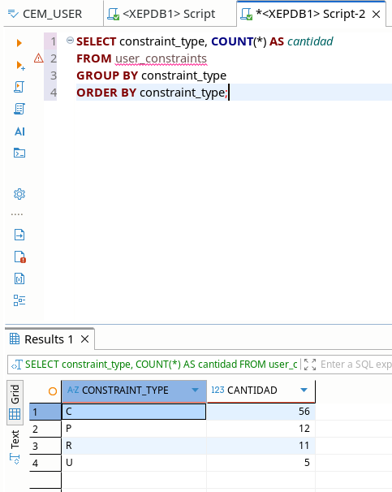

---

## 10. Endpoints CRUD implementados

La API expone operaciones CRUD para todas las tablas del modelo. Cada módulo incluye operaciones para listar, consultar por identificador, crear, actualizar y eliminar registros. Además, se realizaron pruebas de integridad referencial, por ejemplo intentar insertar registros con llaves foráneas inexistentes.

### CRUD CENTROS

| Operación | Método | Endpoint |
|---|---:|---|
| Obtener todos los centros | `GET` | `http://localhost:3000/api/centros` |
| Obtener centro por ID | `GET` | `http://localhost:3000/api/centros/1` |
| Crear Centro | `POST` | `http://localhost:3000/api/centros` |
| Actualizar Centro | `PUT` | `http://localhost:3000/api/centros/4` |
| Eliminar Centro | `DELETE` | `http://localhost:3000/api/centros/7` |


> 

### CRUD DEPARTAMENTO

| Operación | Método | Endpoint |
|---|---:|---|
| Obtener todos los departamentos | `GET` | `http://localhost:3000/api/departamentos` |
| Obtener departamento por ID | `GET` | `http://localhost:3000/api/departamentos/1` |
| Crear Departamento | `POST` | `http://localhost:3000/api/departamentos` |
| Actualizar Departamento | `PUT` | `http://localhost:3000/api/departamentos/4` |
| Eliminar Departamento | `DELETE` | `http://localhost:3000/api/departamentos/4` |


> 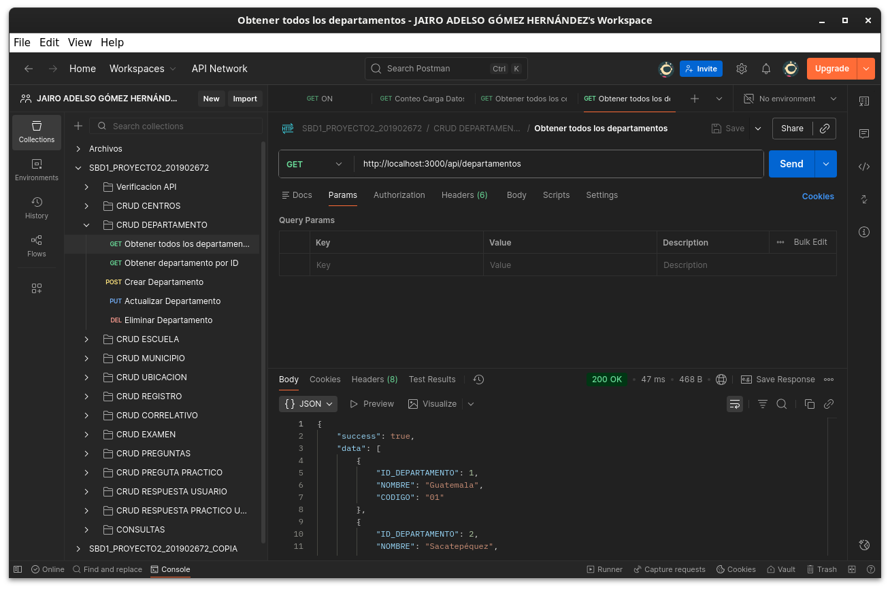

### CRUD ESCUELA

| Operación | Método | Endpoint |
|---|---:|---|
| Obtener todas las escuelas | `GET` | `http://localhost:3000/api/escuelas` |
| Obtener Escuelas por ID | `GET` | `http://localhost:3000/api/escuelas/1` |
| Crear Escuela | `POST` | `http://localhost:3000/api/escuelas` |
| Actualizar Escuela | `PUT` | `http://localhost:3000/api/escuelas/4` |
| Eliminar Escuela | `DELETE` | `http://localhost:3000/api/escuelas/4` |

> 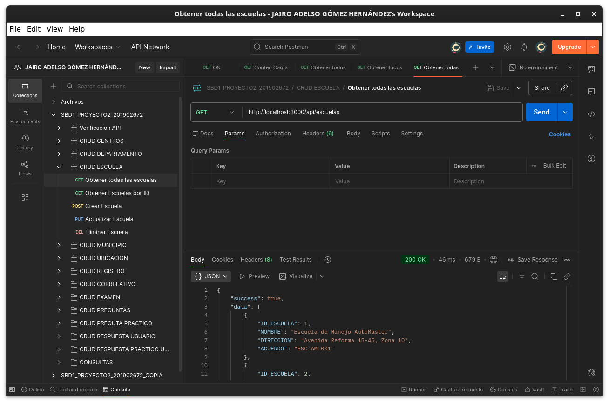

### CRUD MUNICIPIO

| Operación | Método | Endpoint |
|---|---:|---|
| Obtener todos los Municipios | `GET` | `http://localhost:3000/api/municipios` |
| Obtener Municipio por ID | `GET` | `http://localhost:3000/api/municipios/1` |
| Crear Municipio | `POST` | `http://localhost:3000/api/municipios` |
| Actualizar Municipio | `PUT` | `http://localhost:3000/api/municipios/6` |
| Eliminar Municipio | `DELETE` | `http://localhost:3000/api/municipios/6` |


> 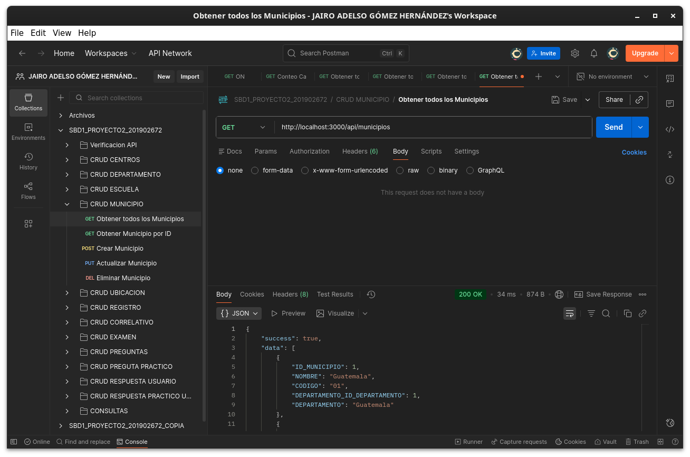

### CRUD UBICACION

| Operación | Método | Endpoint |
|---|---:|---|
| Obtener todas las Ubicaciones | `GET` | `http://localhost:3000/api/ubicaciones` |
| Obtener Ubicacion por ID/ID | `GET` | `http://localhost:3000/api/ubicaciones/1/1` |
| Crear Ubicacion | `POST` | `http://localhost:3000/api/ubicaciones` |
| Actualizar Ubicacion | `PUT` | `http://localhost:3000/api/ubicaciones/5/5` |
| Eliminar Ubicacion | `DELETE` | `http://localhost:3000/api/ubicaciones/5/5` |

> 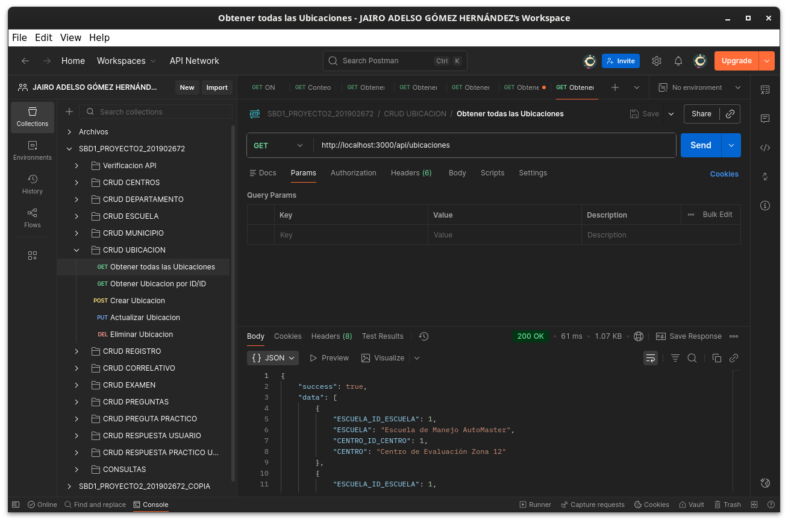

### CRUD REGISTRO

| Operación | Método | Endpoint |
|---|---:|---|
| Obtener todos los Registros | `GET` | `http://localhost:3000/api/registros` |
| Obtener Registros por ID | `GET` | `http://localhost:3000/api/registros/1` |
| Crear Registro | `POST` | `http://localhost:3000/api/registros/` |
| Actualizar Registro | `PUT` | `http://localhost:3000/api/registros/6` |
| Eliminar Registro | `DELETE` | `http://localhost:3000/api/registros/6` |

> 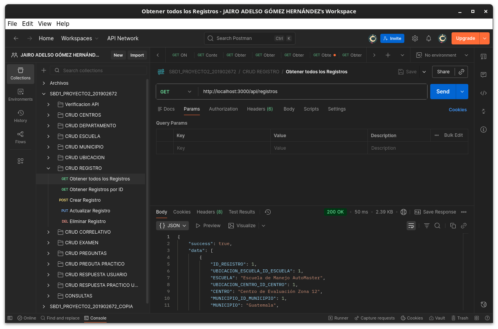

### CRUD CORRELATIVO

| Operación | Método | Endpoint |
|---|---:|---|
| Obtener todos los Correlativos | `GET` | `http://localhost:3000/api/correlativos` |
| Obtener Correlativo por ID | `GET` | `http://localhost:3000/api/correlativos/1` |
| Crear Correlativo | `POST` | `http://localhost:3000/api/correlativos` |
| Actualizar Correlativo | `PUT` | `http://localhost:3000/api/correlativos/6` |
| Eliminar Correlativo | `DELETE` | `http://localhost:3000/api/correlativos/6` |

> 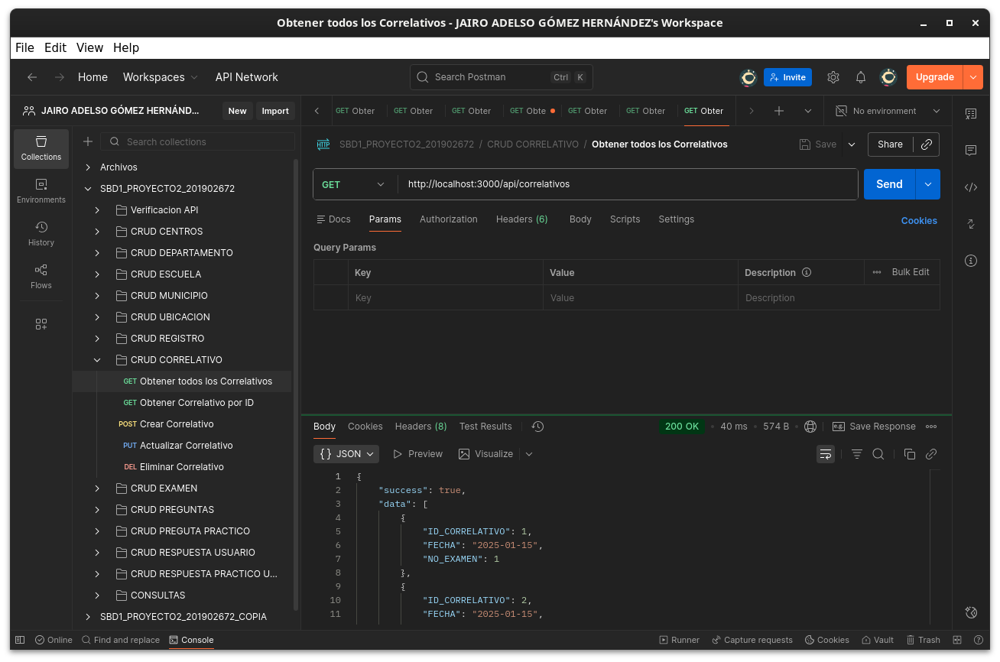

### CRUD EXAMEN

| Operación | Método | Endpoint |
|---|---:|---|
| Obtener todos los Examenes | `GET` | `http://localhost:3000/api/examenes` |
| Obtener Examen por ID | `GET` | `http://localhost:3000/api/examenes/1` |
| Crear Examen | `POST` | `http://localhost:3000/api/examenes` |
| Actualizar Examen | `PUT` | `http://localhost:3000/api/examenes/6` |
| Eliminar Examen | `DELETE` | `http://localhost:3000/api/examenes/6` |

> 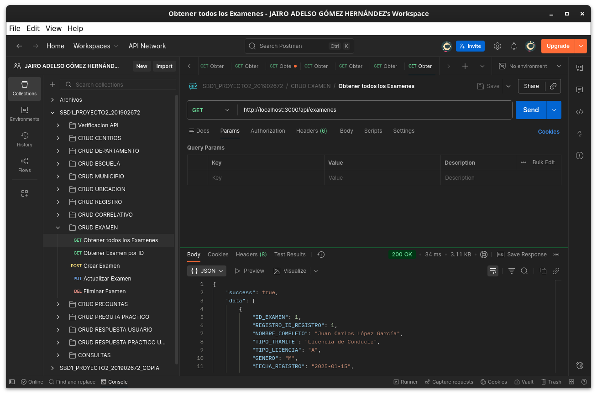

### CRUD PREGUNTAS

| Operación | Método | Endpoint |
|---|---:|---|
| Obtener todas las Preguntas | `GET` | `http://localhost:3000/api/preguntas` |
| Obtener Preguntas por ID | `GET` | `http://localhost:3000/api/preguntas/1` |
| Crear Pregunta | `POST` | `http://localhost:3000/api/preguntas` |
| Actualizar Pregunta | `PUT` | `http://localhost:3000/api/preguntas/5` |
| Eliminar Pregunta | `DELETE` | `http://localhost:3000/api/preguntas/5` |

> 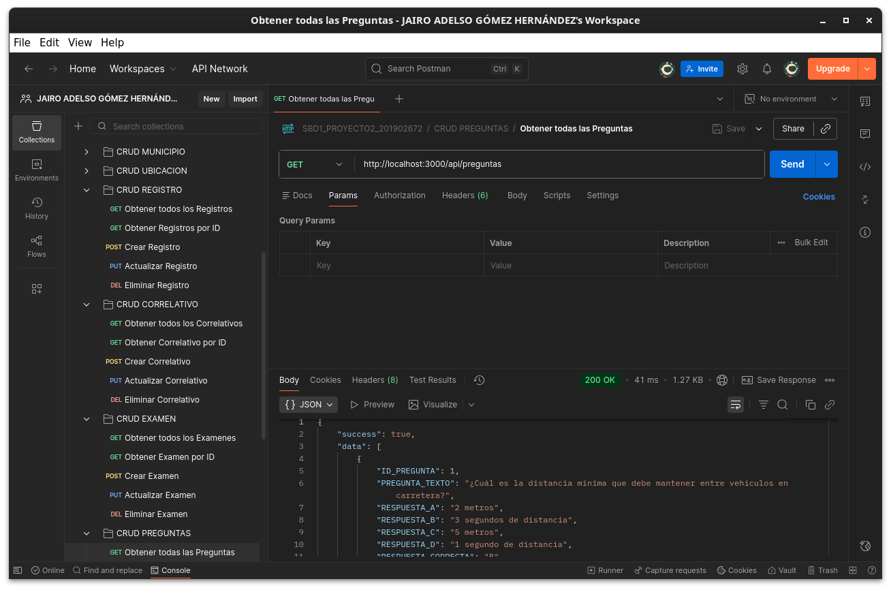

### CRUD PREGUNTAS_PRACTICO

| Operación | Método | Endpoint |
|---|---:|---|
| Obtener todas las Preguntas P | `GET` | `http://localhost:3000/api/preguntas-practico` |
| Obtener Preguntas P por ID | `GET` | `http://localhost:3000/api/preguntas-practico/4` |
| Crear Pregunta Practica | `POST` | `http://localhost:3000/api/preguntas-practico` |
| Actualizar Pregunta Practica | `PUT` | `http://localhost:3000/api/preguntas-practico/5` |
| Eliminar Pregunta Practica | `DELETE` | `http://localhost:3000/api/preguntas-practico/9` |


> 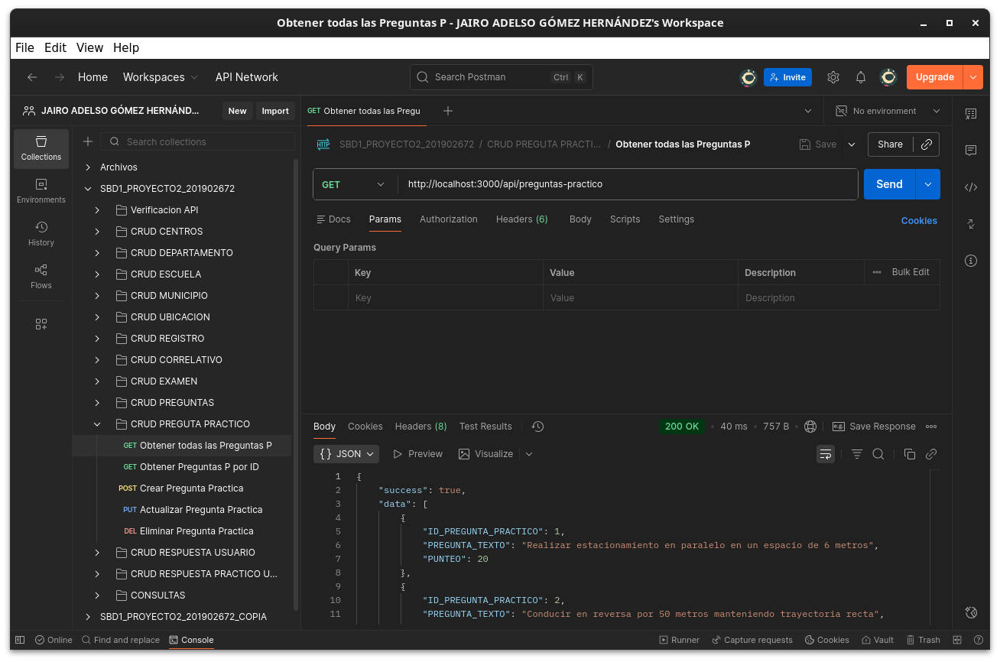

### CRUD RESPUESTA USUARIO

| Operación | Método | Endpoint |
|---|---:|---|
| Obtener todas las Respuestas Usuario | `GET` | `http://localhost:3000/api/respuestas-usuario` |
| Obtener Respuesta Usuario por ID | `GET` | `http://localhost:3000/api/respuestas-usuario/pregunta/1/examen/1` |
| Crear Respuesta Usuario | `POST` | `http://localhost:3000/api/respuestas-usuario` |
| Actualizar Respuesta | `PUT` | `http://localhost:3000/api/respuestas-usuario/pregunta/3/examen/3` |
| Eliminar Respuesta Usuario | `DELETE` | `http://localhost:3000/api/respuestas-usuario/pregunta/3/examen/3` |

> **Evidencia sugerida:** insertar una captura de Postman donde se observe una prueba exitosa del CRUD `RESPUESTA USUARIO`. Para no saturar el documento, se deja una captura por módulo CRUD.
>
> 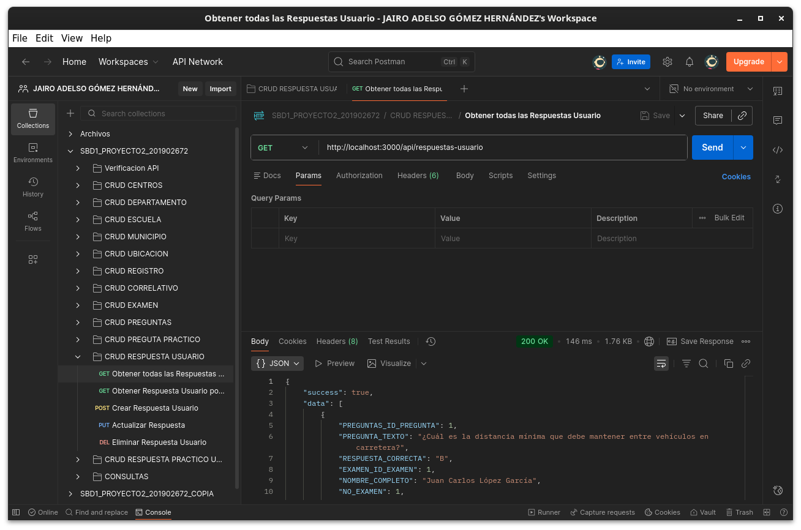

### CRUD RESPUESTA PRACTICO USUARIO

| Operación | Método | Endpoint |
|---|---:|---|
| Obtener todas las RespuestaPracticoUsuario | `GET` | `http://localhost:3000/api/respuestas-practico-usuario` |
| Obtener Respuesta por ID | `GET` | `http://localhost:3000/api/respuestas-practico-usuario/pregunta-practico/1/examen/1` |
| Crear respuesta practica | `POST` | `http://localhost:3000/api/respuestas-practico-usuario` |
| Actualizar Respuesta Practica | `PUT` | `http://localhost:3000/api/respuestas-practico-usuario/pregunta-practico/2/examen/3` |
| Eliminar Respuesta Practico | `DELETE` | `http://localhost:3000/api/respuestas-practico-usuario/pregunta-practico/2/examen/3` |


> 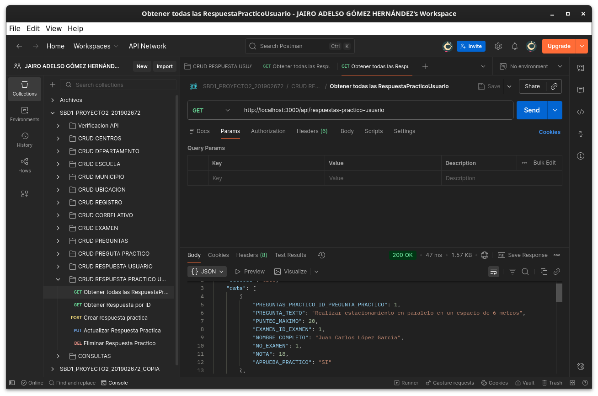

---

## 11. Consultas estadísticas solicitadas

Las consultas estadísticas se agrupan bajo la ruta base:

```http
/api/consultas
```

| Consulta | Método | Endpoint |
|---|---:|---|
| CONSULTA 1 | `GET` | `http://localhost:3000/api/consultas/estadisticas` |
| CONSULTA 2 | `GET` | `http://localhost:3000/api/consultas/ranking` |
| CONSULTA 3 | `GET` | `http://localhost:3000/api/consultas/dificultad-preguntas` |
| CONSULTA 2 REPROBADOS | `GET` | `http://localhost:3000/api/consultas/ranking?estado=REPROBADO` |

---

### 11.1 Consulta 1: Estadísticas de evaluaciones por centro y escuela

**Endpoint:**

```http
GET http://localhost:3000/api/consultas/estadisticas
```

**Objetivo:** mostrar estadísticas agrupadas por centro y escuela. La salida incluye:

- Total de exámenes.
- Promedio de examen teórico.
- Promedio de examen práctico.
- Promedio de resultado final.
- Cantidad de aprobados.
- Cantidad de reprobados.
- Porcentaje de aprobación.

**Criterio usado:** resultado final mayor o igual a 70.

Fragmento lógico de la consulta:

```sql
WITH notas AS (
  SELECT
    e.id_examen,
    c.id_centro,
    c.nombre AS centro,
    es.id_escuela,
    es.nombre AS escuela,
    ROUND(
      NVL(SUM(CASE WHEN ru.respuesta = p.respuesta_correcta THEN 1 ELSE 0 END) /
      NULLIF(COUNT(p.id_pregunta), 0), 0) * 100, 2
    ) AS nota_teorica,
    ROUND(
      NVL(SUM(rpu.nota) / NULLIF(SUM(pp.punteo), 0), 0) * 100, 2
    ) AS nota_practica
  FROM examen e
  JOIN registro r ON r.id_registro = e.registro_id_registro
  JOIN ubicacion u ON u.escuela_id_escuela = r.ubicacion_escuela_id_escuela
                  AND u.centro_id_centro = r.ubicacion_centro_id_centro
  JOIN escuela es ON es.id_escuela = u.escuela_id_escuela
  JOIN centro c ON c.id_centro = u.centro_id_centro
  LEFT JOIN respuesta_usuario ru ON ru.examen_id_examen = e.id_examen
  LEFT JOIN preguntas p ON p.id_pregunta = ru.preguntas_id_pregunta
  LEFT JOIN respuesta_practico_usuario rpu ON rpu.examen_id_examen = e.id_examen
  LEFT JOIN preguntas_practico pp ON pp.id_pregunta_practico = rpu.preguntas_practico_id_pregunta_practico
  GROUP BY e.id_examen, c.id_centro, c.nombre, es.id_escuela, es.nombre
)
SELECT
  id_centro,
  centro,
  id_escuela,
  escuela,
  COUNT(*) AS total_examenes,
  ROUND(AVG(nota_teorica), 2) AS promedio_examen_teorico,
  ROUND(AVG(nota_practica), 2) AS promedio_examen_practico,
  ROUND(AVG((nota_teorica + nota_practica) / 2), 2) AS promedio_resultado_final,
  SUM(CASE WHEN ((nota_teorica + nota_practica) / 2) >= 70 THEN 1 ELSE 0 END) AS aprobados
FROM notas
GROUP BY id_centro, centro, id_escuela, escuela;
```

**Ejemplo de respuesta:**

```json
{
  "success": true,
  "message": "Estadísticas de evaluaciones por centro y escuela",
  "criterio_aprobacion": "Resultado final >= 70",
  "data": [
    {
      "ID_CENTRO": 2,
      "CENTRO": "Centro de Evaluación Antigua Guatemala",
      "ID_ESCUELA": 1,
      "ESCUELA": "Escuela de Manejo AutoMaster",
      "TOTAL_EXAMENES": 1,
      "PROMEDIO_EXAMEN_TEORICO": 50,
      "PROMEDIO_EXAMEN_PRACTICO": 55.56,
      "PROMEDIO_RESULTADO_FINAL": 52.78,
      "APROBADOS": 0,
      "REPROBADOS": 1,
      "PORCENTAJE_APROBACION": 0
    }
  ]
}
```

> **Evidencia Consulta 1:** insertar captura de Postman ejecutando `/api/consultas/estadisticas`.
>
> 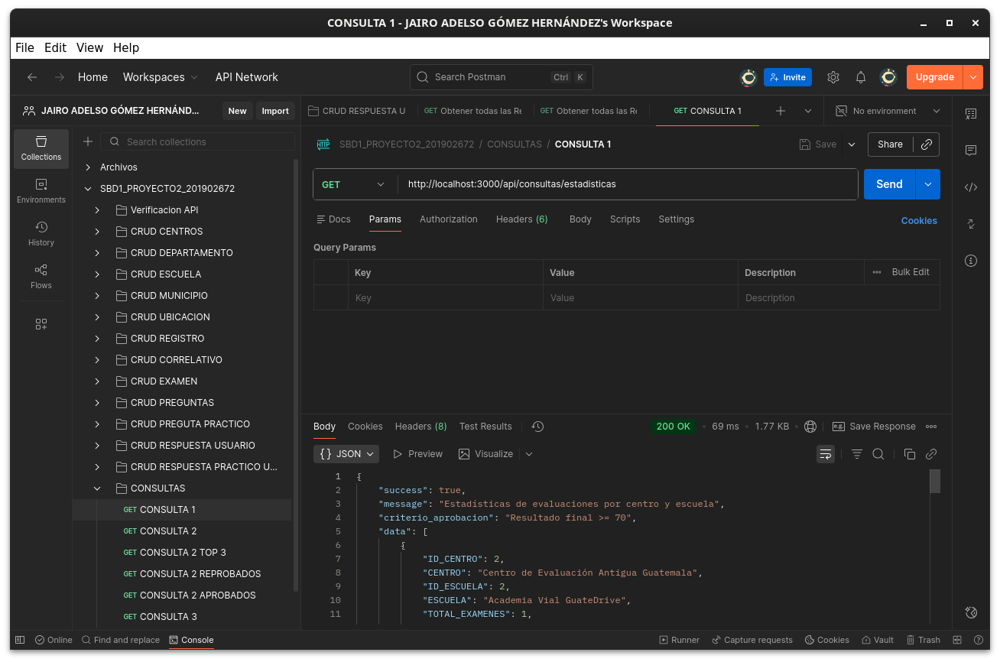

---

### 11.2 Consulta 2: Ranking de evaluados por resultado final

**Endpoint principal:**

```http
GET http://localhost:3000/api/consultas/ranking
```

**Endpoint con filtros:**

```http
GET http://localhost:3000/api/consultas/ranking?limit=3
GET http://localhost:3000/api/consultas/ranking?estado=REPROBADO
GET http://localhost:3000/api/consultas/ranking?estado=APROBADO
```

**Objetivo:** ordenar a los evaluados de mayor a menor según el resultado final del examen. La salida incluye:

- Posición en el ranking.
- Datos del examen.
- Nombre completo del evaluado.
- Tipo de licencia.
- Centro y escuela.
- Nota teórica.
- Nota práctica.
- Resultado final.
- Estado: aprobado o reprobado.

Se utiliza `DENSE_RANK()` para que dos evaluados con la misma nota compartan la misma posición.

Fragmento lógico:

```sql
SELECT *
FROM (
  SELECT
    DENSE_RANK() OVER (ORDER BY resultado_final DESC) AS posicion,
    id_examen,
    no_examen,
    id_registro,
    nombre_completo,
    tipo_licencia,
    centro,
    escuela,
    nota_teorica,
    nota_practica,
    resultado_final,
    CASE WHEN resultado_final >= 70 THEN 'APROBADO' ELSE 'REPROBADO' END AS estado
  FROM resultados_examen
)
WHERE (:estado = 'TODOS' OR estado = :estado)
FETCH FIRST :limit ROWS ONLY;
```

**Ejemplo de respuesta:**

```json
{
  "success": true,
  "message": "Ranking de evaluados por resultado final",
  "criterio_aprobacion": "Resultado final >= 70",
  "filtros": {
    "limit": 10,
    "estado": "TODOS"
  },
  "data": [
    {
      "POSICION": 1,
      "ID_EXAMEN": 2,
      "NO_EXAMEN": 2,
      "ID_REGISTRO": 2,
      "NOMBRE_COMPLETO": "María Elena Rodríguez Morales",
      "TIPO_LICENCIA": "B",
      "CENTRO": "Centro de Evaluación Antigua Guatemala",
      "ESCUELA": "Escuela de Manejo AutoMaster",
      "NOTA_TEORICA": 50,
      "NOTA_PRACTICA": 55.56,
      "RESULTADO_FINAL": 52.78,
      "ESTADO": "REPROBADO"
    }
  ]
}
```

> 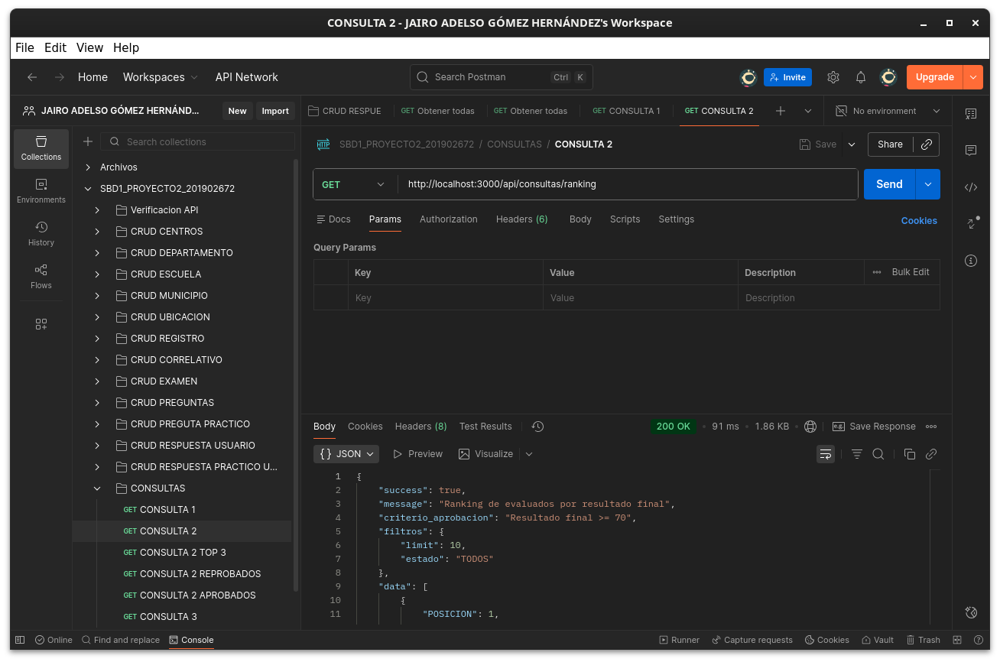

---

> 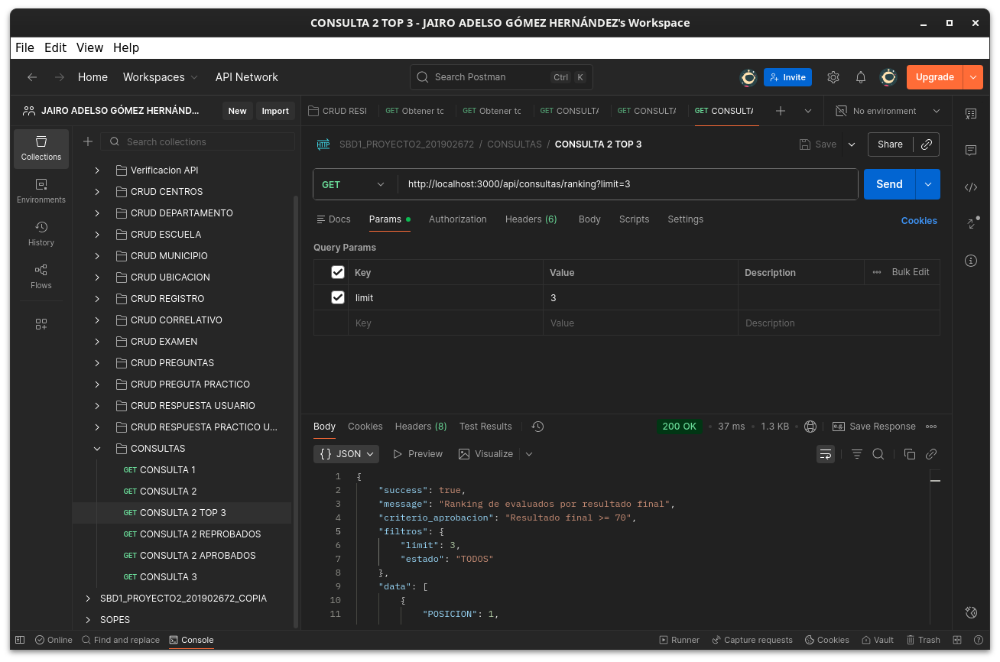

---

### 11.3 Consulta 3: Pregunta o preguntas con menor porcentaje de aciertos

**Endpoint:**

```http
GET http://localhost:3000/api/consultas/dificultad-preguntas
```

**Objetivo:** identificar la pregunta o preguntas teóricas con menor porcentaje de aciertos. La salida debe basarse en el porcentaje de aciertos, no solamente en el conteo absoluto. Si hay dos o más preguntas empatadas con el menor porcentaje, el endpoint devuelve todas.

Fragmento lógico:

```sql
WITH estadistica_preguntas AS (
  SELECT
    p.id_pregunta,
    p.pregunta_texto,
    p.respuesta_correcta,
    COUNT(ru.examen_id_examen) AS total_respuestas,
    SUM(CASE WHEN ru.respuesta = p.respuesta_correcta THEN 1 ELSE 0 END) AS total_aciertos,
    COUNT(ru.examen_id_examen) -
      SUM(CASE WHEN ru.respuesta = p.respuesta_correcta THEN 1 ELSE 0 END) AS total_errores,
    ROUND(
      NVL(
        SUM(CASE WHEN ru.respuesta = p.respuesta_correcta THEN 1 ELSE 0 END) /
        NULLIF(COUNT(ru.examen_id_examen), 0),
        0
      ) * 100,
      2
    ) AS porcentaje_aciertos
  FROM preguntas p
  LEFT JOIN respuesta_usuario ru
    ON ru.preguntas_id_pregunta = p.id_pregunta
  GROUP BY p.id_pregunta, p.pregunta_texto, p.respuesta_correcta
), ranking AS (
  SELECT ep.*,
         DENSE_RANK() OVER (ORDER BY porcentaje_aciertos ASC) AS posicion_dificultad
  FROM estadistica_preguntas ep
  WHERE total_respuestas > 0
)
SELECT
  id_pregunta,
  pregunta_texto,
  respuesta_correcta,
  total_respuestas,
  total_aciertos,
  total_errores,
  porcentaje_aciertos
FROM ranking
WHERE posicion_dificultad = 1;
```

**Ejemplo de respuesta:**

```json
{
  "success": true,
  "message": "Pregunta o preguntas con menor porcentaje de aciertos",
  "total_preguntas_encontradas": 1,
  "data": [
    {
      "ID_PREGUNTA": 2,
      "PREGUNTA_TEXTO": "¿Qué significa una señal de alto?",
      "RESPUESTA_CORRECTA": "B",
      "TOTAL_RESPUESTAS": 2,
      "TOTAL_ACIERTOS": 1,
      "TOTAL_ERRORES": 1,
      "PORCENTAJE_ACIERTOS": 50
    }
  ]
}
```

> 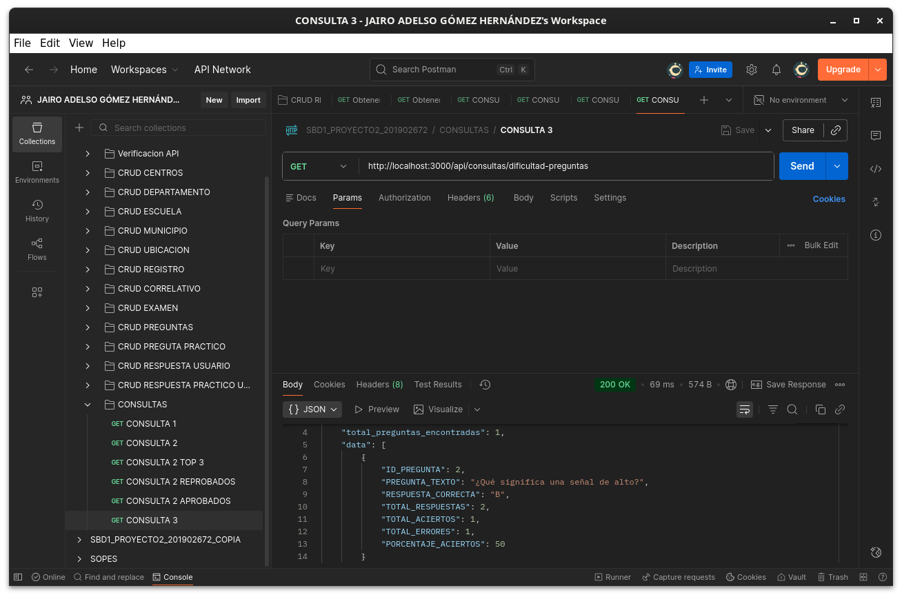

---

## 12. Colección de Postman

El proyecto incluye la colección:

```text
SBD1_PROYECTO2_201902672.postman_collection.json
```

Esta colección contiene pruebas para:

- Verificación general de la API.
- Conteo de datos cargados.
- CRUD de las 12 tablas.
- Consultas estadísticas.
- Ejemplos de pruebas con integridad referencial.

### 12.1 Endpoints incluidos en la colección

#### Verificación API

| Operación | Método | Endpoint |
|---|---:|---|
| ON | `GET` | `http://localhost:3000/` |
| Conteo Carga Datos | `GET` | `http://localhost:3000/api/db/conteos` |

#### Consultas estadísticas

| Consulta | Método | Endpoint |
|---|---:|---|
| CONSULTA 1 | `GET` | `http://localhost:3000/api/consultas/estadisticas` |
| CONSULTA 2 | `GET` | `http://localhost:3000/api/consultas/ranking` |
| CONSULTA 3 | `GET` | `http://localhost:3000/api/consultas/dificultad-preguntas` |
| CONSULTA 2 REPROBADOS | `GET` | `http://localhost:3000/api/consultas/ranking?estado=REPROBADO` |


> 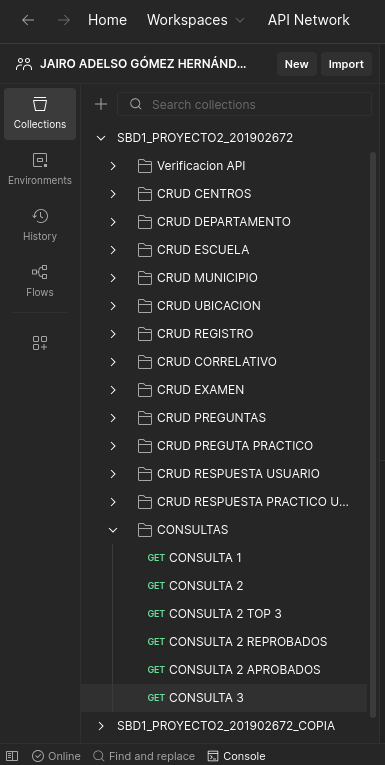

---

## 13. Pruebas de error e integridad referencial

Además de las pruebas exitosas, se realizaron pruebas con datos inválidos para comprobar que las llaves foráneas y validaciones del modelo funcionan correctamente.

Ejemplo: intentar crear un municipio con un departamento inexistente.

```json
{
  "nombre": "Municipio Prueba",
  "codigo": "9901",
  "departamento_id_departamento": 999
}
```

Respuesta esperada:

```json
{
  "success": false,
  "message": "Error al crear municipio",
  "error": "Restricción de integridad referencial o llave foránea inválida"
}
```

Ejemplo: intentar crear una ubicación con escuela o centro inexistente.

```json
{
  "escuela_id_escuela": 999,
  "centro_id_centro": 999
}
```

Estas pruebas evidencian que la base de datos no permite insertar información huérfana y que la API responde de forma controlada ante errores.

> 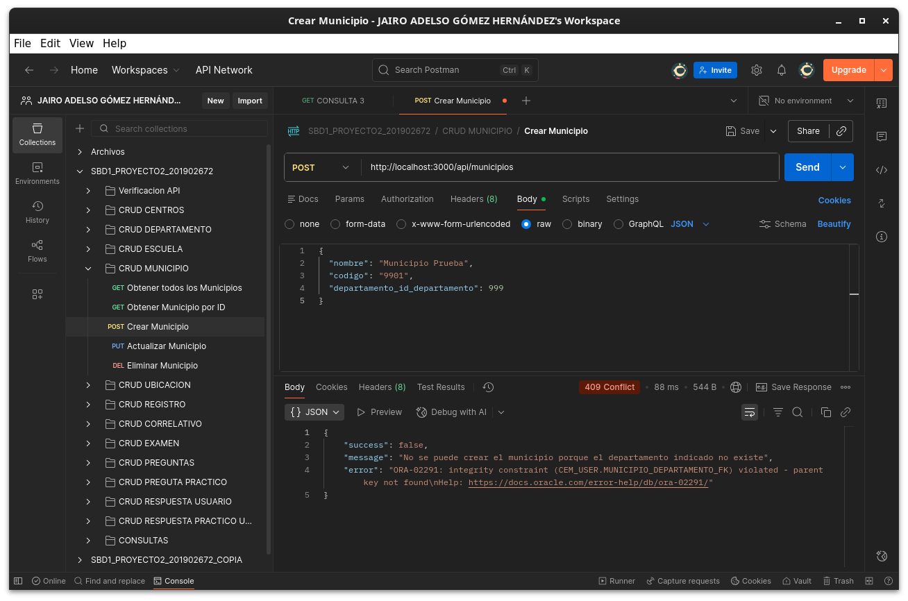

---

## 14. Flujo general del sistema

```text
Usuario / Evaluador
        |
        v
Postman / Cliente HTTP
        |
        v
API REST Node.js + Express
        |
        v
Driver oracledb
        |
        v
Oracle XE 21c en Docker
        |
        v
Tablas del modelo CEM_USER
```

### Explicación del flujo

1. El usuario consume un endpoint desde Postman.
2. Express recibe la solicitud y la envía al router correspondiente.
3. El router llama al controlador asociado.
4. El controlador ejecuta SQL mediante la conexión Oracle.
5. Oracle valida restricciones, ejecuta la operación y devuelve el resultado.
6. La API responde en formato JSON.

---

## 15. Comandos útiles de Revision y Pruebas

### Docker

```bash
docker compose up -d
docker ps
docker logs -f sbd1_proyecto2_oracle
docker compose down
docker compose down -v
```

### Backend

```bash
cd backend
npm install
npm run dev
```

### Validación rápida de API

```bash
curl http://localhost:3000/
curl http://localhost:3000/api/db/conteos
curl http://localhost:3000/api/consultas/estadisticas
curl http://localhost:3000/api/consultas/ranking
curl http://localhost:3000/api/consultas/dificultad-preguntas
```

### Validación rápida en Oracle

```sql
SELECT USER FROM dual;

SELECT table_name
FROM user_tables
ORDER BY table_name;

SELECT constraint_type, COUNT(*) AS cantidad
FROM user_constraints
GROUP BY constraint_type
ORDER BY constraint_type;
```

---


## 16. Conclusión

El proyecto cumple con la integración de infraestructura, base de datos y backend solicitada. Oracle XE se ejecuta en Docker con inicialización automática del esquema y datos semilla. La API REST en Node.js/Express permite administrar todas las tablas mediante CRUD y ejecutar las tres consultas estadísticas requeridas. Además, la colección de Postman sirve como evidencia funcional y facilita la revisión de cada endpoint durante la calificación.

---

